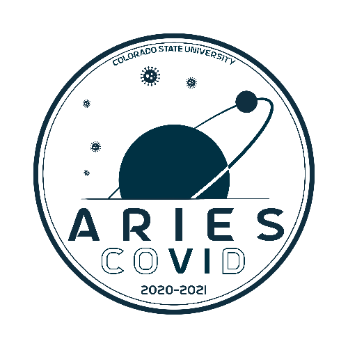

# direram 
DireRam is the ground station software used by CSU's Spaceport America Cup Rocket Team for displaying recieved APRS/GPS packets and ground filling operations. It's name is heavily inspired by [Dire Wolf](https://github.com/wb2osz/direwolf), which this application is built around.

## Install
A Windows installer can be found in the [releases](https://github.com/Kmschr/direram/releases/tag/v1.0)
